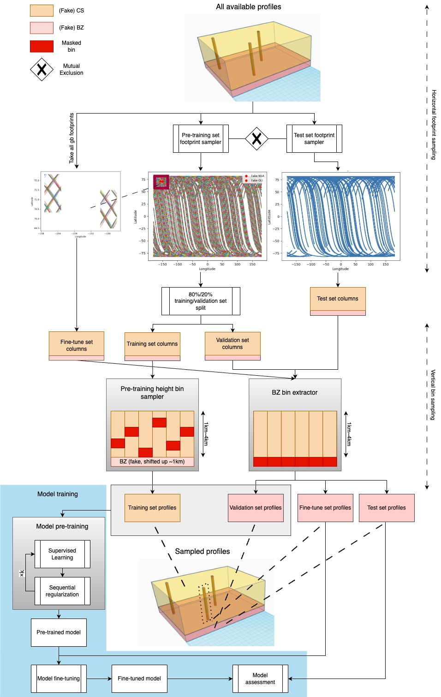
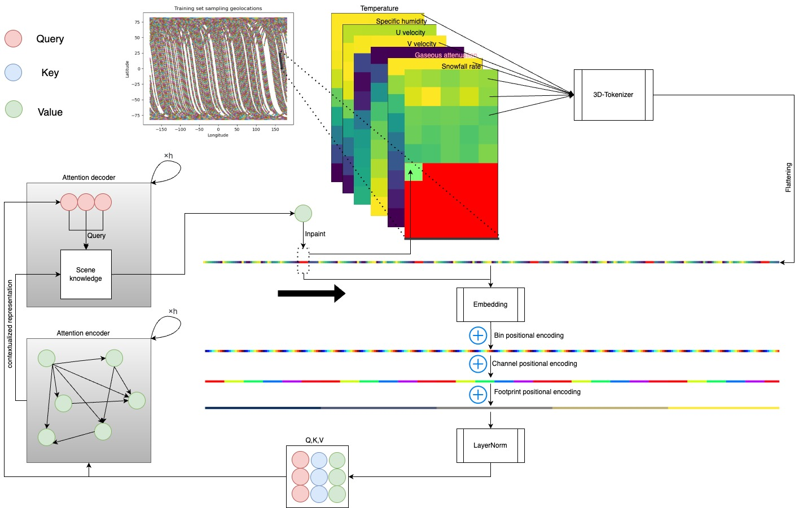

# CloudSat-near-surface-profile-reconstruct
A research project developing a Transformer-based model to reconstruct global near-surface hydrometeor profiles in CloudSat mission's blind zone. The model follows a pre-training fine-tune approach for transfer learning to overcome the domain shift along the horizontal and vertical dimensions while "flying".

## Project title
A transfer learning approach to reconstruct ground-cluttered near-surface snowfall global profiles from spaceborne radar
Author: Ding Li, MMATH in Computational Mathematics, Faculty of Mathematics
Advisor: Dr. Chris Fletcher

## Abstract
Understanding the processes that generate snowfall near the surface is vital for monitoring and modeling the water cycle and energy budget in Earth's climate. Spaceborne W-band cloud-profiling radar offers a quasi-global coverage but is hindered by ground clutter in the lowest 1 km, creating a "blind zone" lacking reliable observations. These flawed hydrometeor profiles introduce biases and uncertainties into downstream retrievals, model simulations, and scientific analyses. It is a research priority to develop a reliable methodology to reconstruct useful near-surface profiles from the clutter. Existing methods to address this blind zone rely on localized models and sparse ground-based observations, limiting their generalizability and introducing domain shift biases when applied to remote regions. In this study, we propose an optimized transfer learning strategy to reconstruct near-surface snowfall profiles with global coverage for the first time. This involves 1) pre-training a model on a global self-recovery task using aloft observations above the blind zone, and 2) fine-tuning with sparse, costly ground-based observations targeting unseen heights within the blind zone. We test the approach by only using the lowest-altitude reliable observations above the blind zone, thus overcoming the scarcity of global blind-zone ground-truth data for validation. According to the results, the approach is likely to significantly reduce reliance on scarce and costly ground-truth labels in the blind zone while mitigating bias towards them, benefiting global-scope research based on near-surface hydrometeor profiles. Meanwhile, the first attempt to reconstruct flawed near-surface profiles on a global scope defines a new model benchmark task for future works to follow and compete.

## Model training paradigm

## Model structure

*Caption: Model architecture. Granules are sampled randomly, but the footprints are always adjacent to ensure the conservation of the horizontal spatial autocorrelation. The profiles are flattened through a 3D-tokenizer along 1) footprint, 2) channel, and 3) vertical bin in sequence. Positional encodings for the three dimensions are added in the same order. Query, key, and value are embedded vectors of each pixel token in the learned vector space, based on which the attention encoder headers capture the relationships between tokens pairwise to yield a contextualized representation of the current “climate scene”. The decoder headers read the existing information (from both given and already-predicted) and predict the next token in the blind zone based on the "scene knowledge" from the encoder headers. The predicted token is then mapped back to the blind zone, and then appended to the tokenized vector. The process inpaints the blind zone in sequence autoregressively, from top to bottom, from left to right. The window size for one “climate scene” is constrained to 5-by-5 based on the quasi-Markov assumption to reduce running time. The "scene knowledge" from the encoder and the existing information read by the decoder are dynamically updated accordingly.*
